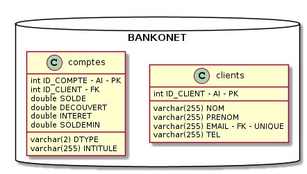
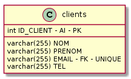
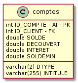
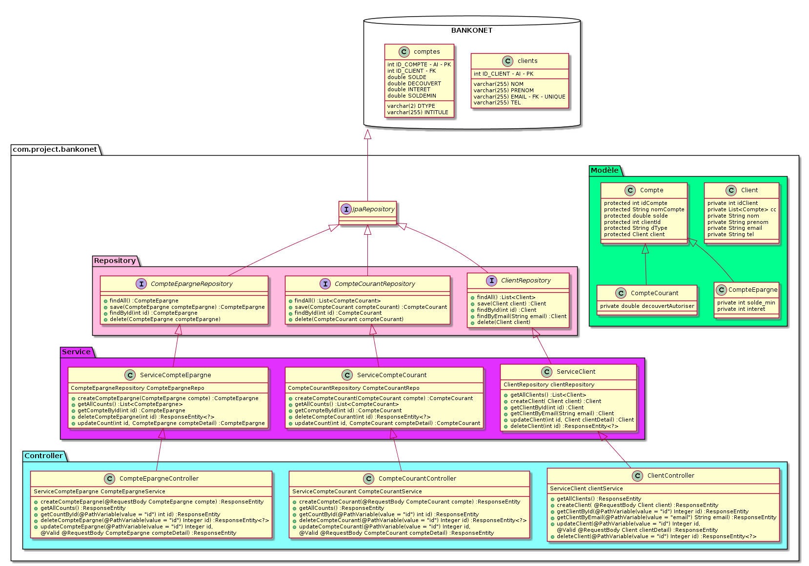
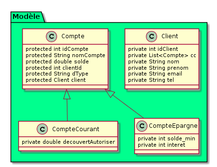
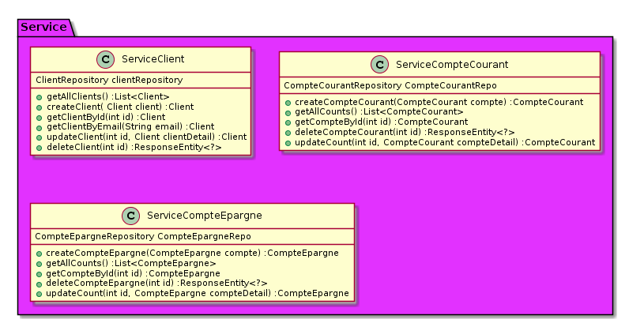
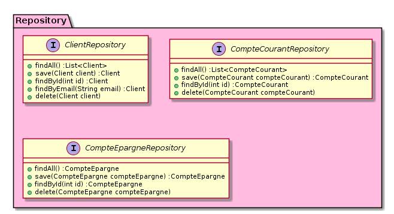
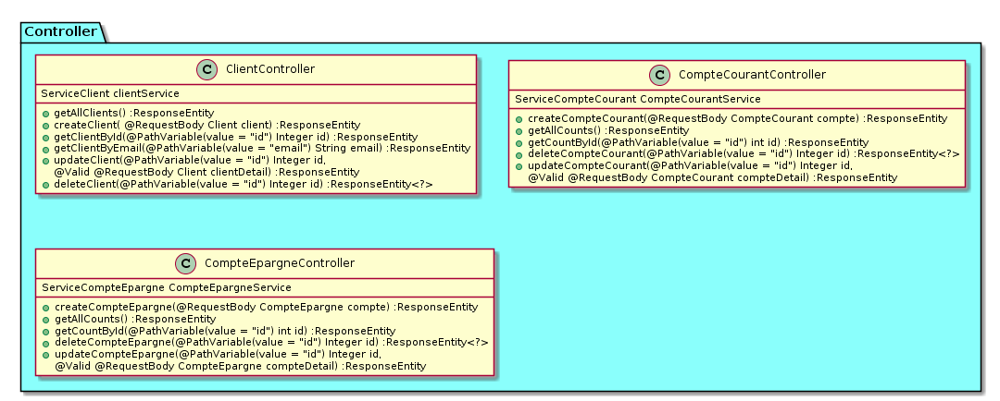

= Specifications Fonctionnelles du Projet BANKONET

<<<

[cols=2*]
|===
|Référence
|nom du fichier à placer

|Date de création
|30 Octobre 2018

|Date de dernière mise à jour
|10 Novembre 2018

|Etat
|Validé

|Version
|V1.0.0

|Auteur
|Antoine Ribal +
Théo Tenaguillo
|===

<<<

== Table des Matières:

. Introduction
.. Définition du projet
.. Les différents acteurs
.. Gestion des versions

. Présentation des fonctionnalitées
.. Généralités
.. Fonctionnalitées coté Agent
.. Fonctionnalitées coté Client

. Technique
.. Technologies utilisées
.. Structure de la base de données
... Table Client
... Table Compte
.. Architecture JAVA Spring
... Modèle
... Service
... Controller
.. Architecture Angular
... Modèle
... Vue
... Controller
.. API REST
... Introduction
... Documentation de l'API Bankonet

. Utilisation
.. Cas d'utilisation Côté Agent
... Cas d'utilisation: création de client
... Cas d'utilisation: consultation de client
... Cas d'utilisation: modification de client
... Cas d'utilisation: suppression de client
.. Cas d'utilisation Côté Client
... Cas d'utilisation: Depot d'argent
... Cas d'utilisation: Virement
... Cas d'utilisation: Consultation de ses comptes
... Cas d'utilisation: Modification des données personnelles
... Cas d'utilisation: Cloture compte épargne

== 1) Introduction

=== a) Definition du projet
Le projet Bankonet à pour vocation d'être une banque en ligne ayant pour objectifs
de concurrencer la banque en ligne OrangeBank +
Ce document vient se placer dans le mouvement et l'évolution du système bancaire actuelle
qui tend vers le tout numérique. +
Afin de mener à bien cet objectif, nous nous concentrerons sur la réalisation d'une application
permettant de gérer les clients ainsi que leur placement au sein de notre entreprise.

=== b) Les différents acteurs
Pour pouvoir développer cette application et rendre ce projet possible, nous avons fait appel à nos meilleurs éléments,
Théo Ténaguillo ainsi qu'Antoine Ribal, n'ayant jamais fais leur preuve mais sans aucun doute de grands génies grandement incompris,
la direction technique à choisis d'utiliser leur compétence afin de mener à bien ce projet, sous la supervision de Phillipe Bousquet expert technique.

=== c) Gestion des Versions
Bien entendu ce document ne sera aucunement mis à jour une fois complété. La levée de fond de Bankonet ne permettant que 2 semaines de développement,
nous nous concentreront sur la partie technique. Cependant par soucis de professionalisme, nous feront en sorte que la v1 et vDerniere soit aussi une version final descente.

== 2) Présentation des fonctionnalités.

=== a) Généralités
L'application aura pour but d'enregistrer les clients, leurs informations personnelles ainsi que leur solde courant depuis un espace agent.
Nous offrirons aussi la possibilités par le biais d'un agent, de créer un ou plusieurs compte épargne permettant de stocker l'argent et d'en dégager des interets variables.
Mais également de pouvoir modifier ou supprimmer un compte utilisateur après avoir déplacé l'argent des comptes épargnes vers le compte courant
avant la suppression.

=== b) Fonctionnalités coté Agent
. Créer Client : +
L'agent devra pouvoir créer un compte client dans la base de données et y ajouter les informations personnels suivantes: +
Nom / Prénom / Email / Téléphone +
Un identifiant unique sera crée pour chacun d'eux

. Modifier un client : +
L'agent doit pouvoir modifier les informations personnels d'un client depuis son espace

. Supprimer un client : +
L'agent doit pouvoir supprimer un client, dès lors l'argent épargné devra être versé sur le compte courant, puis les comptes épargnes seront supprimés. +
Ensuite l'argent du compte courant devra être viré vers un autre compte puis le compte courant sera supprimé et pour finir l'utilisateur sera effacé.

. Modifier découvert : +
L'agent doit pouvoir modifier le plafond de découvert autorisé d'un client

. Modifier taux interet d'un compte épargne d'un client.

. Cloturer un compte

=== c) Fonctionnalité coté Client

. Lister ses comptes : +
L'utilisateur doit pouvoir consulté la liste de ses comptes ainsi que leur informations (soldes, intitulé, découvert autorisé, intéret)

. Editer ses données personnelles : +
L'utilisateur doit pouvoir modifier ses données : email et téléphone
. Cloturer compte Epargne : +
L'utilisateur doit pouvoir clôturer un compte épargne lui appartenant, celui ci devra être d'un solde de 0$.

. Virement vers autres comptes : +
L'utilisateur doit pouvoir envoyer de l'argent sur un autre compte, et ce montant doit lui être déduit.
. Crediter son compte : +
Le client doit pouvoir mettre de l'argent sur son compte

== 3) Technique

=== a) Technologies utilisées

[cols=2*,options="header"]
|===
|Partie
|Technologie

|Front
|Angular

|Back
|Java - Spring boot

|SGBD
|MySQL

|
|

|Auteur
|Antoine Ribal +
Théo Tenaguillo
|===

=== b) Structure de la base de données
La Base de Données sera gérer avec MySQL +
Le logiciel utilisé pour la conception sera : MySQL WorkBench +
Nous avons fais le choix de deux tables, une pour les clients , et une pour gérer
tout les comptes en les distinguant par une colonne discriminante. Le compte Agent
sera gérer depuis Spring. +
Ci-dessous, un schéma de conception de la base de donnée:

==== Table Client
Les clients sont définis par : NOM | PRENOM | EMAIL | TEL +
Pour relier les comptes à nos clients nous ferons une jointure sur ID_CLIENT. +
Ici, EMAIL est UNIQUE afin de pouvoir s'en servir comme identifiant de connexion. +

PRIMARY KEY = PK +
AUTO INCREMENT = AI +
FOREIGN KEY = FK +
UNIQUE = "Pas de double autorisé dans la table"

==== Table Compte
Les comptes présent dans la table peuvent se diviser en 2 types de comptes qui
se partage certains attributs : ID_COMPTE | ID_CLENT | SOLDE | INTITULE | DTYPE +
Pour pouvoir les différencier dans notre application nous utiliserons la colonne DTYPE
comme colonne discriminante. +
Leur attribut spécifiques (retrouvé "null" dans l'autre type) : +
- Compte Courant : DECOUVERT +
- Compte Epargne : INTERET | SOLDEMIN

PRIMARY KEY = PK +
AUTO INCREMENT = AI +
FOREIGN KEY = FK +

=== c) Architecture Java Spring
Diagramme de classe :

==== Modèle
Le modèle ci-dessous rejoint la structure de la base de données,
on représente les tables par des objets et le tronc commun de la table comptes
par héritage. +
On viendra ajouter a la classe Client un attribut List qui permettra d'y stocker
tout les comptes qui lui sont liés.

Diagramme de classe UML :

==== Service
Nos service nous permettent, en implémentant nos inteface Repository, de pouvoir creer des
fonctions utilisant les fonctions CRUD de JPARepositoiry afin d'intéragir avec notre base de données. +
Ensuite ces services sont importés dans la couche controller qui les appeleras, en fonction des
cas d'utilisation.  +
Ci-dessous les diagrammes de classe correspondant.

==== Controller
Il représente la couche la plus en surface du projet, ce sont ses fonctions qui
seront appelés par les differentes API et ce
par un remarquable travail de mapping réalisé sur chacun des controller. +
Le controleur à pour vocation de tester certaines règles de validation avant d'aller
plus loin dans les processus du programme.

=== d) Architecture Angular
==== Modèle
==== Vue
==== Controller

=== e) API REST
==== Introduction
==== Documentation API Bankonet

== 4) Utilisation
=== a) Cas d'utilisation Côté Agent
==== Cas d'utilisation: création de client
==== Cas d'utilisation: consultation de client
==== Cas d'utilisation: modification de client
==== Cas d'utilisation: suppression de client
=== b) Cas d'utilisation Côté Client
==== Cas d'utilisation: Depot d'argent
==== Cas d'utilisation: Virement
==== Cas d'utilisation: Consultation de ses comptes
==== Cas d'utilisation: Modification des données personnelles
==== Cas d'utilisation: Cloture compte épargne
